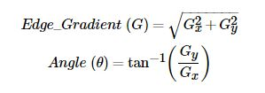
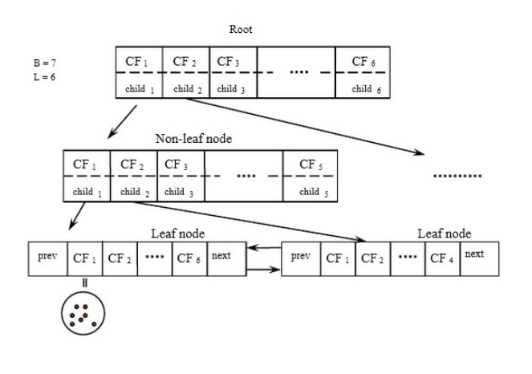

>   **Case Study Report**

**Folio Clustering**

(Gom cụm hình ảnh lá cây)

**Giáo viên hướng dẫn:** Huỳnh Thị Thanh Thương

**Sinh viên nghiên cứu:**

Nguyễn Trường Phát 17520880

Vũ Đình Vi Nghiệm 17520805

Nguyễn Chí Bảo 17520271

# 1. Phát biểu bài toán
=====================

1.1. Mục đích
-------------

Xây dựng một mô hình để phân cụm các loại lá dựa trên hình ảnh của chúng.

1.2 Đầu vào
-----------

Một bộ dataset gồm 637 hình ảnh 32 loại lá không nhãn (được xáo trộn):

1. Beaumier du perou

2. Eggplant

3. Fruitcitere

4. Guava

5. Hibiscus

6. Betel

7. Rose

8. Chrysanthemum

9. Ficus

10. Duranta gold

11. Ashanti blood

12. Bitter Orange

13. Coeur Demoiselle

14. Jackfruit

15. Mulberry Leaf

16. Pimento1

7. Pomme Jacquot

18. Star Apple

19. Barbados Cherry

20. Sweet Olive

21. Croton

22. Thevetia

23. Vieux Garcon

24. Chocolate tree

25. Carricature plant

26. Coffee

27. Ketembilla

28. Chinese guava

29. Lychee

30. Geranium

31. Sweet potato

32. Papaya

1.3 Đầu ra
----------

Một mô hình gom cụm có thể phân cụm (hi vọng) chính xác được các hình lá này
thành các nhóm.

2. Xây dựng mô hình từ tập huấn luyện
=====================================

2.1 Biểu diễn dữ liệu - Trích xuất đặc trưng
--------------------------------------------

Trích xuất đặc trưng là các phương pháp biểu diễn dữ liệu (data representation)
bằng một cách nào đó để lấy ra những thông tin quan trọng từ dữ liệu và loại bỏ
những thông tin thừa thải.

### 2.1.1. Phương pháp Canny Edge Detection

**[8]** Trong hình ảnh, thường tồn tại các thành phần như: vùng trơn, góc / cạnh
và nhiễu. Cạnh trong ảnh mang đặc trưng quan trọng, thường là thuộc đối tượng
trong ảnh (object). Do đó, để phát hiện cạnh trong ảnh, giải thuật Canny là một
trong những giải thuật phổ biến / nổi tiếng nhất trong Xử lý ảnh.

Giải thuật phát hiện cạnh Canny gồm 4 bước chính sau:

>   **1) Giảm nhiễu**: Làm mờ ảnh, giảm nhiễu dùng bộ lọc Gaussian kích thước
>   5x5. Kích thước 5x5 thường hoạt động tốt cho giải thuật Canny. Dĩ nhiên bạn
>   cũng có thể thay đổi kích thước của bộ lọc làm mờ cho phù hợp. Tham khảo bài
>   viết: [Xử lý ảnh - Làm mờ ảnh
>   (blur)](https://minhng.info/tutorials/xu-ly-anh-bo-loc-lam-mo-blur.html)

>   **2) Tính Gradient và hướng gradient**: ta dùng bộ lọc Sobel X và Sobel Y
>   (3x3) để tính được ảnh đạo hàm Gx và Gy. Tham khảo bài viết giải thích về
>   gradient: [Gradient của ảnh là
>   gì?](https://minhng.info/tutorials/xu-ly-anh-opencv-gradient-la-gi.html).
>   Sau đó, ta tiếp tục tính ảnh Gradient và góc của Gradient theo công thức.
>   Ảnh đạo hàm Gx và Gy là ma trận (ví dụ: 640x640), thì kết quả tính ảnh đạo
>   hàm Edge Gradient cũng là một ma trận (640x640), mỗi pixel trên ma trận này
>   thể hiện độ lớn của biến đổi mức sáng ở vị trí tương ứng trên ảnh gốc. Tương
>   tự, ma trận Angle cũng có cùng kích thước (640x640), mỗi pixel trên Angle
>   thể hiện góc, hay nói cách khác là hướng của cạnh. Ví dụ dễ hiểu, nếu góc
>   gradient là 0 độ, thì cạnh của ta trên ảnh sẽ là một đường thẳng đứng (tức
>   tạo góc 90 độ so với trục hoành) (**vuông góc hướng gradient**). Khi tính
>   toán, giá trị hướng gradient sẽ nằm trong đoạn [-180, 180] độ, ta không giữ
>   nguyên các góc này mà gom các giá trị này về 4 bin đại diện cho 4 hướng:
>   hướng ngang (0 độ), hướng chéo bên phải (45 độ), hướng dọc (90 độ) và hướng
>   chéo trái (135 độ).

>   **3) Non-maximum Suppression** (viết tắt NMS): loại bỏ các pixel ở vị trí
>   không phải cực đại toàn cục. Ở bước này, ta dùng một filter 3x3 lần lượt
>   chạy qua các pixel trên ảnh gradient. Trong quá trình lọc, ta xem xét xem độ
>   lớn gradient của pixel trung tâm có phải là cực đại (lớn nhất trong cục bộ -
>   local maximum) so với các gradient ở các pixel xung quanh. Nếu là cực đại,
>   ta sẽ ghi nhận sẽ giữ pixel đó lại. Còn nếu pixel tại đó không phải là cực
>   đại lân cận, ta sẽ set độ lớn gradient của nó về zero. Ta chỉ so sánh pixel
>   trung tâm với 2 pixel lân cận theo **hướng gradient**. Ví dụ: nếu hướng
>   gradient đang là 0 độ, ta sẽ so pixel trung tâm với pixel liền trái và liền
>   phải nó. Trường hợp khác nếu hướng gradient là 45 độ, ta sẽ so sánh với 2
>   pixel hàng xóm là góc trên bên phải và góc dưới bên trái của pixel trung
>   tâm. Tương tự cho 2 trường hợp hướng gradient còn lại. Kết thúc bước này ta
>   được một mặt nạ nhị phân (ảnh nhị phân - [tham khảo bài
>   viết](https://minhng.info/tutorials/opencv-anh-nhi-phan.html) để hiểu ảnh
>   nhị phân nhé). Tham khảo hình dưới:

>   **4) Lọc ngưỡng**: ta sẽ xét các pixel dương trên mặt nạ nhị phân kết quả
>   của bước trước. Nếu giá trị gradient vượt ngưỡng **max_val** thì pixel đó
>   **chắc chắn là cạnh**. Các pixel có độ lớn gradient nhỏ hơn ngưỡng
>   **min_val** sẽ bị loại bỏ. Còn các pixel nằm trong khoảng 2 ngưỡng trên sẽ
>   được xem xét rằng nó có nằm liên kề với những pixel được cho là "chắc chắn
>   là cạnh" hay không. Nếu liền kề thì ta giữ, còn không liền kề bất cứ pixel
>   cạnh nào thì ta loại. Sau bước này ta có thể áp dụng thêm bước hậu xử lý
>   loại bỏ nhiễu (tức những pixel cạnh rời rạc hay cạnh ngắn) nếu muốn. Ảnh
>   minh họa về ngưỡng lọc:

### 2.1.2. Phương pháp HOG 

HOG là viết tắt của Histogram of Oriented Gradient - một loại “feature
descriptor”. Mục đích của “feature descriptor” là trừu tượng hóa đối tượng bằng
cách trích xuất ra những đặc trưng của đối tượng đó và bỏ đi những thông tin
không hữu ích. Vì vậy, HOG được sử dụng chủ yếu để mô tả hình dạng và sự xuất
hiện của một đối tượng trong ảnh

Bản chất của phương pháp HOG là sử dụng thông tin về sự phân bố của các cường độ
gradient (intensity gradient) hoặc của hướng biên (edge directins) để mô tả các
đối tượng cục bộ trong ảnh. Các toán tử HOG được cài đặt bằng cách chia nhỏ một
bức ảnh thành các vùng con, được gọi là “tế bào” (cells) và với mỗi cell, ta sẽ
tính toán một histogram về các hướng của gradients cho các điểm nằm trong cell.
Ghép các histogram lại với nhau ta sẽ có một biểu diễn cho bức ảnh ban đầu. Để
tăng cường hiệu năng nhận dạng, các histogram cục bộ có thể được chuẩn hóa về độ
tương phản bằng cách tính một ngưỡng cường độ trong một vùng lớn hơn cell, gọi
là các khối (blocks) và sử dụng giá trị ngưỡng đó để chuẩn hóa tất cả các cell
trong khối. Kết quả sau bước chuẩn hóa sẽ là một vector đặc trưng có tính bất
biến cao hơn đối với các thay đổi về điều kiện ánh sáng. **[1]**

### 2.1.3. Phương pháp tích chập (convolution) và giảm số chiều (pooling)

Tích chập (Convolution) và giảm số chiều (Pooling) là hai khái niệm quan trọng
được sử dụng rất nhiều trong Thị giác Máy tính.

**Lưu ý**: ở đây chúng ta không sử dụng mạng CNN để huấn luyện bất kì hình nào
cả, chúng ta sẽ sử dụng pretrained model (đã được huấn luyện) để lấy các bộ tham
số cuả convolution kernel để rút trích đặc trưng sử dụng cho vấn đề của chúng
ta, ở đây là gom cụm hình ảnh lá.

#### 2.1.3.1 Tích chập (Convolution)

Convolution (tích chập) là toán tử mà ta thực hiện xoay cửa sổ 180 độ (flip
over, tức flip 2 lần lần lượt theo trục x và y) rồi sau đó áp dụng phép
correlation (tương quan). **[2]**

Giả sử chúng ta có 1 tấm hình con nai, và một kernel nhận diện cạnh như bên
dưới, chúng ta sẽ tìm ra một feature map (đặc trưng tương ứng) của tấm hình ứng
với kernel này.

#### 2.1.3.2. Giảm số chiều (Pooling)

Pool Layer thực hiện chức năng làm giảm chiều không gian của đầu và giảm độ phức
tạp tính toán của model ngoài ra Pool Layer còn giúp kiểm soát hiện tượng
overffiting. Thông thường, Pool layer có nhiều hình thức khác nhau phù hợp cho
nhiều bài toán, tuy nhiên Max Pooling được sử dụng nhiều và phổ biến hơn cả với
ý tưởng cũng rất sát với thực tế con người đó là: Giữ lại chi tiết quan trọng
hay hiểu ở trong bài toán này chính giữ lại pixel có giá trị lớn nhất. **[3]**

Ngoài ra, còn có các phương pháp Pooling khác như Global Weight Average Pooling,
Min Pooling hay Stochastic Pooling.

#### 2.1.3.3. Rút trích đặc trưng

Trong Thị giác Máy tính truyền thống, việc lựa chọn kernel để tích chập là thủ
công bằng các phương pháp nghiên cứu và thực nghiệm. Sau đó các kernel này sẽ
được sử dụng để rút trích đặc trưng, ánh xạ từ 1 hình sang 1 hình feature map
khác (chứa các đặc trưng tương ứng) giàu và dày đặc hơn và đưa vào mạng truyền
thẳng để huấn luyện. Ở trong mạng CNN các giá trị của kernel này được tham số
hóa, tức là chúng ta coi như kernel là một ma trận tham số, thay vì tìm kiếm
thực nghiệm thì sẽ coi nó như một cái hộp đen để mạng nơ-ron tự học ra, điều này
có thể cho ra kết quả bất ngờ hơn nhiều so với cách tích chập truyền thống, giờ
đây mạng CNN đã có thể tự học ra kernel mà chúng muốn rút trích đặc trưng, không
phụ thuộc vào kiến thức rút trích đặc trưng của con người.

Qua các lớp convolution, hình ảnh sẽ từ spatial features (các đặc trưng về không
gian) thành semantic feature (các đặc trưng về ngữ nghĩa) có chiều sâu hơn. Vì
lượng thông tin hình ảnh gốc sẽ rất thưa (spatial), việc sử dùng Convolution và
Pooling để rút trích đặc trưng sẽ tìm được feature map tương ứng với lượng thông
tin dày đặc (dense) và mang nhiều ý nghĩa (semantic) hơn.

2.2. Các thuật toán gom cụm
---------------------------

### 2.2.1. K-means Clustering

**[4]** Thuật toán K-means có thể nói là thuật toán phổ biến nhất trong các
thuật toán gom cụm trong Machine Learning.

Ý tưởng đơn giản nhất về cluster (cụm) là tập hợp các điểm ở gần nhau trong một
không gian nào đó(không gian này có thể có rất nhiều chiều trong trường hợp
thông tin về một điểm dữ liệu là rất lớn). Hình bên dưới là một ví dụ về 3 cụm
dữ liệu (từ giờ tôi sẽ viết gọn là cluster).

Giả sử mỗi cluster có một điểm đại diện (center) màu vàng. Và những điểm xung
quanh mỗi center thuộc vào cùng nhóm với center đó. Một cách đơn giản nhất, xét
một điểm bất kỳ, ta xét xem điểm đó gần với center nào nhất thì nó thuộc về cùng
nhóm với center đó. Tới đây, chúng ta có một bài toán thú vị: Trên một vùng biển
hình vuông lớn có ba đảo hình vuông, tam giác, và tròn màu vàng như hình trên.
Một điểm trên biển được gọi là thuộc lãnh hải của một đảo nếu nó nằm gần đảo này
hơn so với hai đảo kia . Hãy xác định ranh giới lãnh hải của các đảo.

Đầu vào: Dữ liệu XX và số lượng cluster cần tìm KK.

Đầu ra: Các center MM và label vector cho từng điểm dữ liệu YY.

1.  Chọn KK điểm bất kỳ làm các center ban đầu.

2.  Phân mỗi điểm dữ liệu vào cluster có center gần nó nhất.

3.  Nếu việc gán dữ liệu vào từng cluster ở bước 2 không thay đổi so với vòng
    lặp trước nó thì ta dừng thuật toán.

4.  Cập nhật center cho từng cluster bằng cách lấy trung bình cộng của tất các
    các điểm dữ liệu đã được gán vào cluster đó sau bước 2.

5.  Quay lại bước 2.

### 2.2.2. DBSCAN

DBSCAN (density0based spatial clustering of applications with noise) là thuật
toán phân cụm dữ liệu dựa trên mật độ (density-based clustering): cho một bộ/tập
hợp các điểm nằm trong một không gian nào đó, thuật toán sẽ gom nhóm các điểm
sắp xếp ở gần nhau (mật độ dày đặc) còn các điểm ngoại lệ (nhiễu) nằm một mình
hoặc trong khu vực có mật độ thấp.

#### 2.2.2.1.Các định nghĩa và tiêu chí:

Esp: một trong2 tham số đầu vào của thuật toán, thể hiện khoảng cách tối đa giữa
hai điểm/mẫu để cho một điểm được coi là nằm trong vùng lân cận của điểm còn
lại, có thể hiểu là trong không gian hai chiều, Esp là bán kính để xác định vùng
lân cận và các điểm lân cận của một điểm/mẫu.

**MinPts:** tham số còn lại, số lượng điểm/mẫu ít nhất trong một vùng lân cận
(tạo bởi Esp) để điểm điểm/mẫu đang xét được coi là một core point. MinPts bao
gồm cả điểm/mẫu đang xét.

**Core point:** Một điểm/mẫu gọi là core point nếu trong lân cận Esp của nó có
ít nhất MinPts điểm/mẫu (tính cả nó)

**Border point:** là các điểm/mẫu còn lại nằm trong vùng lân cận của các core
point. Các core point có thể có chung nhiều border point.

**Noise (nhiễu):** là các điểm/mẫu còn lại nằm ngoài vùng lân cận của tất cả các
core point. Hiểu đơn giản là nếu không phải border hay core point thì là noise.

Các quan hệ trong cùng một cụm:

Directly (density) reachable: điểm b gọi là directly reachable từ điểm c nếu
điểm b nằm trong vùng lân cận Esp của **core point** c.

(Density) reachable: điểm b gọi là reachable từ điểm c nếu tồn tại một chuỗi thứ
tự điểm p1, p2, …, pn (với p1 = c và pn = b) sao cho điểm pi+1 **directly
reachable** từ điểm pi. Nói cách khoảng cách từ pi tới pi+1 nhỏ hơn hoặc bằng
Esp với mọi điểm trong chuỗi này ngoài điểm pn (b) là core point.

Density connected: điểm b1 gọi là density connected với điểm b2 nếu chùng cùng
**reachable** từ một điểm c. (Do hai mối quan hệ trên không có tính đối xứng,
quan hệ này được hình thành để tạo nên mỗi quan hệ giữa hai điểm không phải core
point và cũng bởi vì theo định nghĩa của hai mối quan hệ trên, không có điểm nào
có thể reachable từ điểm không phải core point bật kể khoảng cách.)

#### 2.2.2.2. Thuật toán:

Do tìm hiểu từ nhiều nguồn khác nhau, thuật toán này được đúc kết từ sự hiểu
biết của bản thân.

1.  Xác định các core point dựa trên Eps và MinPts cho trước, những điểm nào
    không phải core point xem như là noise.

2.  Chọn một core point c tùy ý chưa được xét và hình thành cụm mới.

3.  Thêm tất cả các điểm nằm trong vùng lân cận (Eps-neighborhood) của điểm c
    vào chung cụm với nó. Các noise (hoặc các điểm không phải core point) nằm
    trong lân cận này thành các border point.

4.  Xét các core point còn lại nằm trong vùng lân cận của c.

5.  Quay lại bước 3 cho tới khi xét hết các core point của cụm đang xét.

6.  Quay lại bước 2 cho tới khi xét hết các core point trong bộ dữ liệu.

#### 2.2.2.3. Các ưu và nhược điểm:

**Ưu điểm:**

-   Với một bộ tham số Esp và MinPts tốt, DBSCAN có thể xác định được bất kỳ số
    cụm nào mà không cần có một kiến thức hoặc hiểu biết trước về số cụm của bộ
    dữ liệu.

-   Bất cứ cụm với kích thước và hình dáng nào cũng có thể tìm được.

-   Có thể xác định và bỏ qua được những dữ liệu thừa, không cần thiêt (noise).

**Nhược điểm:**

-   Các cụm khác nhau vẫn có nguy cơ chia sẻ chung các border point, phụ thuộc
    vào quá trình xử lý dữ liệu mà các border point này được gán cho cụm nào.

-   Phụ thuộc vào hai tham số Esp và MinPts:

    -   Nếu vùng lân cận quá nhỏ cộng với MinPts ít thì có nguy cơ phần lớn hoặc
        cả bộ dữ liệu bị coi là nhiễu.

    -   Nếu vùng lân cận lớn thì các cụm ở gần nhau sẽ bị coi như là một cụm, tệ
        nhất là cả bộ dữ liệu được coi là chung một cụm với nhau.

### 2.2.3. BIRCH

#### 2.2.3.1. Ý tưởng thuật toán

**[7]** Ý tưởng của thuật toán là không cần lưu toàn bộ các đối tượng dữ liệu
của các cụm trong bộ nhớ mà chỉ lưu các đại lượng thống kê .

Đối với mỗi cụm dữ liệu, BIRCH chỉ lưu một bộ ba (n, LS, SS), với n là số đối
tượng trong cụm, LS là tổng các giá trị thuộc tính của các đối tượng trong cụm
và SS là tổng bình phương các giá trị thuộc tính của các đối tượng trong cụm .
Các bộ ba này được gọi là các đặc trưng của cụm CF=(n, LS, SS) (Cluster Features
CF) và được lưu giữ trong một cây được gọi là cây CF.

Cây CF là cây cân bằng, nhằm để lưu trữ các đặc trưng của cụm. Cây CF chứa các
nút trong và nút lá. Nút trong lưu giữ tổng các đặc trưng cụm của các nút con
của nó. Một cây CF được đặc trưng bởi hai tham số:

-   Yếu tố nhánh (B): Nhằm xác định số tối đa các nút con của mỗi nút trong của
    cây;

-   Ngưỡng (T): Khoảng cách tối đa giữa bất kỳ một cặp đối tượng trong nút lá
    của cây, khoảng cách này còn gọi là đường kính của các cụm con được lưu tại
    các nút .

Hai tham số này có ảnh hưởng lớn đến kích thước của cây CF.

#### 2.2.3.1. Ưu nhược điểm

**Ưu điểm**

-   Sử dụng cấu trúc cây CF làm cho thuật toán BIRCH có tốc độ thực hiện PCDL
    nhanh và có thể áp dụng đối với tập dữ liệu lớn, BIRCH đặc biệt hiệu quả khi
    áp dụng với tập dữ liệu tăng trưởng theo thời gian.

-   BIRCH chỉ duyệt toàn bộ dữ liệu một lần với một lần quét thêm tuỳ chọn,
    nghĩa là độ phức tạp của nó là O(n) (n là số đối tượng dữ liệu)

**Nhược điểm**

-   Chất lượng của các cụm được khám phá không được tốt

-   Nếu BIRCH sử dụng khoảng cách Euclide, nó thực hiện tốt chỉ với các dữ liệu
    số. Mặt khác, tham số vào T có ảnh hưởng rất lớn tới kích thước và tính tự
    nhiên của cụm

-   Việc ép các đối tượng dữ liệu làm cho các đối tượng của một cụm có thể là
    đối tượng kết thúc của cụm khác, trong khi các đối tượng gần nhau có thể bị
    hút bởi các cụm khác nếu chúng được biểu diễn cho thuật toán theo một thứ tự
    khác

-   BIRCH không thích hợp với dữ liệu đa chiều.

### 2.2.4. Hierachical Agglomerative Clustering

Là một dạng thuật toán gom cụm phân cấp (Hierarchical). Trong đó có 2 cách tiếp
cận:

>   Agglomerative Hierarchical Clustering (AHC hay HAC): với cách tiếp cận
>   bottom up, đi các cụm nhỏ và gộp dần thành các cụm lớn hơn.

>   Divisive Hierarchical Clustering (DHC): với cách tiếp cận top down, đi từ 1
>   cụm lớn và chia nhỏ dần thành các cụm nhỏ hơn.

**Các tiêu chuẩn tính khoảng cách**

-   Minimum or [single-linkage
    clustering](https://en.wikipedia.org/wiki/Single-linkage_clustering) : Dùng
    2 điểm gần nhất giữa 2 cluster

-   Maximum or [complete-linkage
    clustering](https://en.wikipedia.org/wiki/Complete-linkage_clustering) :
    Dùng 2 điểm xa nhất giữa 2 cluster

-   Unweighted average linkage clustering (or
    [UPGMA](https://en.wikipedia.org/wiki/UPGMA))): Dùng 2 điểm trung tâm giữa 2
    cluster

**Thuật toán**

1.  Khởi tạo tất cả n cụm dữ liệu (1 điểm dữ liệu/cụm)

2.  Đưa 2 cụm gần nhau nhất (theo tiêu chuẩn tính khoảng cách bạn chọn) về thành
    1 cụm

3.  Gom cho đến khi bạn đạt được n_clusters mong muốn thì thuật toán kết thúc

### 2.2.5 Spectral Clustering

**[9]** Trong thống kê đa biến và phân cụm dữ liệu, kỹ thuật spectral clustering
cho phép tận dụng giá trị đặc trưng của ma trận tương tự với dữ liệu lớn để thực
hiện giảm chiều trước khi chia thành các kích thước nhỏ hơn. Đầu vào là ma trận
tương tự bao gồm định lượng giống nhau tương đối của mỗi cặp trong tập dữ liệu.

Mục tiêu của thuật toán này là:

-   Xử lý phân nhóm tương tự như phân vùng đồ thị mà không sử dụng các giả định
    về hình thức của các cụm.

-   Nhóm chỉ sử dụng các vector riêng của ma trận được lấy từ các dữ liệu có
    sẵn.

-   Kết nối dữ liệu đến một không gian ít chiều hơn sau khi được tách ra để có
    thể dễ dàng xử lý tiếp.

2.3. Các phương pháp đánh giá
-----------------------------

### 2.3.1. Homogeneity (Tính đồng nhất)

Để thỏa mãn tính Homogeneity, mỗi cụm chỉ chứa các điểm dữ liệu thuộc về một lớp
duy nhất.

Trong đó:

-   h là chỉ số Homogeneity

-   C là số class

-   K là số cụm,

-   ack là số class c thuộc cluster k

-   n là số lượng class

### 2.3.2. Completeness (Tính đầy đủ)

Để thỏa mãn tính đầy đủ, các điểm dữ liệu cùng thuộc một lớp chỉ được gom về một
cụm duy nhất

### 2.3.3. V-measure 

Tương tự như F1-score, V-measure là trung bình cộng điều hòa có trọng số
(Weighted sHarmonic Mean) giữa 2 chỉ số Homogeneity và Completeness.

Nếu c \> 1, Homogeneity sẽ được đánh tỉ trọng cao hơn khi tính V-measure, và
ngược lại, Completeness sẽ được đánh trọng số cao hơn. Ở thư viện sklearn, chỉ
số β = 1, tức tương tự trường hợp tính F1-score từ Precision và Recall.

2.4. Tối ưu siêu tham số (Hyperparameters tuning)
-------------------------------------------------

Các mô hình được đặc trưng bởi các bộ siêu tham số của nó, vậy câu hỏi đặt ra là
làm sao chọn ra một siêu tham số tốt? Ngoài những kiến thức về kiến trúc của mô
hình, chúng ta còn phải tìm kiếm thực nghiệm để tìm ra bộ tham số này bởi vì bộ
siêu tham số phụ thuộc rất nhiều vào dữ liệu. Một trong những phương pháp tìm
kiếm đó ta có GridSearch và RandomSearch

### 2.4.1. Grid Search

Grid Search là một phương pháp tìm kiếm ra siêu tham số tối ưu của một mô hình
bằng cách vét cạn tất cả các tổ hợp siêu tham số trên tập xét có thể để tìm ra
bộ tốt nhất.

### 2.4.2. Random Search

Random Search là phương pháp tìm kiếm ra siêu tham số tối ưu bằng cách thử các
tổ hợp ngẫu nhiên các siêu tham số để tìm ra bộ tốt nhất.

3. Thực nghiệm
==============

3.1. Canny
----------

|                          | **Homogeneity** | **Completeness** | **V-measure** | **Cấu hình**            |
|--------------------------|-----------------|------------------|---------------|-------------------------|
| K-means Clustering       | 0.2277959058    | 0.4202450946     | 0.2954446152  | n_clusters=32           |
| DBScan                   | 0               | 1                | 0             | Không thể xác định đúng |
| Spectral Clustering      | 0.3338292195    | 0.4254421412     | 0.3741087187  | n_clusters=32           |
| Birch                    | 0               | 1                | 0             | Không thể xác định đúng |
| Agglomerative Clustering | 0.2846053501    | 0.4395013141     | 0.3454861875  | n_clusters=32           |

### 3.1.1 Nhận xét

Thực nghiệm khi sử dụng công cụ do từ các thư viện sklearn và cv2 do có sự chưa
chuận xác nên không thể tìm ra kết quả tốt. Ba thuật toán xác định sẵn số cụm
tìm ra được v-measure nhưng thấp. Còn DBSCAN và Birch do có đến tận hai tham số,
DBSCAN do quá nhiều chiều nên khó xác định được khoảng cách hợp lý, còn Birch
thì thuật toán chưa thể tìm ra số cụm lớn hơn 1.

3.2. HOG
--------

|                          | **Homogeneity** | **Completeness** | **V-measure** | **Cấu hình**                                      |
|--------------------------|-----------------|------------------|---------------|---------------------------------------------------|
| K-means Clustering       | 0.6672273462    | 0.6857031938     | 0.6763391153  | n_clusters=32                                     |
| DBScan                   | 0.5437785744    | 0.693322069      | 0.6095117456  | GridSearch(eps=9.5, min_samples=2)                |
| Spectral Clustering      | 0.7189812149    | 0.7373639756     | 0.7280565768  | n_clusters=32                                     |
| Birch                    | 0.7391132803    | 0.753767754      | 0.7463685912  | threshold=5.4, branching_factor=21, n_clusters=32 |
| Agglomerative Clustering | 0.7338987198    | 0.7544392289     | 0.7440272349  | n_clusters=32                                     |

### 3.2.1 Nhận xét

Birch và Agglomerative Clustering ra được chỉ số v-measure tương đối tốt (0.74)
và Spectral Clustering chỉ kém hơn khoảng 0.01 điểm (0.73). Tiếp theo là K-Means
có kết quả cũng khả quan với v-measure gần 0.67. Cuối cùng là DBSCAN với
v-measure (0.6) nói riêng và cả ba chỉ số nói chung tương đối bình thường với
hiệu số có thể gọi là thấp nhất trong năm thuật toán.

### 3.2.2. Visualization

Để hiểu rõ hơn về phương pháp rút trích đặc trưng HOG, ta sẽ thử plot thử ra để
hình tượng hóa các đặc trưng này. Các hình “sao” hay chéo thể hiện cạnh của vật
thể (lá), càng đậm thì ta biết được vị trí này là biên giữa vật thể mà nền và
hướng của các dấu thể hiện hướng của cạnh (edge direction).

*3.2.2.1. Visualize của HOG*

3.3. Convolution + Pooling Feature Extraction
---------------------------------------------

|                          | **Homogeneity** | **Completeness** | **V-measure** | **Cấu hình**                                                   |
|--------------------------|-----------------|------------------|---------------|----------------------------------------------------------------|
| K-means Clustering       | 0.9037          | 0.9149           | 0.9092        | n_clusters=32                                                  |
| DBScan                   | 0.8864          | 0.7471           | 0.8108        | GridSearch (EPS = 0.56, MinPts = 1)                            |
| Spectral Clustering      | 0.9116          | 0.9235           | 0.9175        | n_clusters=32                                                  |
| Birch                    | 0.7898          | 0.8884           | 0.8362        | GridSearch (n_clusters=32,branching_factor=21,threshold= 0.59) |
| Agglomerative Clustering | 0.9414          | 0.9545           | 0.9479        | n_clusters=32                                                  |

### 3.3.1. Nhận xét

Agglomerative Clustering cho kết quả ưu việt nhất với V-measure là 0.9479 vượt
xa DBSCAN ở cuối bảng với V-measure 0.8108. Bên cạnh đó K-means Clustering và
Spectral Clustering cũng cho kết quả khả quan (V measure trên 0.9) với kết quả
lần lượt 0.9092 và 0.9175. Tuy nhiên, Birch chỉ nhỉnh hơn cuối bảng 1 tí với
V-measure 0.8362.

DBSCAN và Birch là 2 thuật toán không khai báo n_clusters và có tận tới 2 tham
số tùy chọn, do đó có 2 nguyên nhân dẫn đến sự kém hiệu quả khi dùng:

\- Nguyên nhân chủ quan: Việc tối ưu siêu tham số (Hyperparameter tuning) có thể
chưa thật sự hiệu quả, chúng ta chỉ search trên miền mà chúng ta quan tâm và
GridSearch chạy quá chậm. Có thể sử dụng Random Search để giới hạn vùng tìm kiếm
lại và ra nhiều kết quả bất ngờ hơn.

\- Nguyên nhân khách quan: Thuật toán Birch và DBSCAN có nhiều siêu tham số
(\>=2) nên việc tìm kiếm bộ tham số này khá khó khăn. So với các thuật toán khác
chỉ sử dụng 1 tham số thì việc thì trở nên dễ dàng hơn rất nhiều.

### 3.3.2. Visualization

Để hiểu rõ hơn về các đặc trưng được rút trích qua các lớp tích chập, chúng ta
sẽ thử truyền thẳng (forward propagation) một ảnh và xem các feature được rút
trích là gì. Lưu ý rằng, có nhiều cách visualization mạng CNN khác như: Maximal
Activating Patches, Saliency vs Occlusion, etc.

*3.2.2.1. khối tích chập đầu tiên*

*3.2.2.2. Khối tích chập thứ 2*

*3.2.2.3. Khối tích chập thứ 4*

*3.2.2.4. Khối tích chập thứ 5*

Có thể thấy, mạng CNN đạt kết quả thật sự ưu việt so với các cách rút trích đặc
trưng khác, mạng đã rút trích từ những đặc trưng bậc cao nhất như góc cạnh và
dần dần rút trích ra các đặc trưng bậc thấp của tấm ảnh: những chi tiết bên
trong lá; điều mà khó có thể thực hiện được chỉ bởi kiến thức của con người.

3.4. Sử dụng các mô hình phân lớp đã học
----------------------------------------

Ở đây chúng ta vẫn sẽ sử dụng các đặc trưng được rút trích từ các lớp tích chập
của CNN và đưa vào giải quyết bài toán khác của chúng ta là bài toán phân lớp.

| **Mô hình**         | **Accuracy** | **Cấu hình**                             |
|---------------------|--------------|------------------------------------------|
| Logistic Regression | 0.98         | multi_class='multinomial',solver="lbfgs" |
| KNN                 | 0.98         | mặc định thư viện                        |
| MultinomialNB       | 0.98         | alpha=0.01                               |
| GuassianNB          | 0.96         | mặc định thư viện                        |
| DecisionTree        | 0.62         | mặc định thư viện                        |
| RandomForest        | 0.92         | min_samples_leaf=7,random_state=8        |

Ở đây chúng ta sử dụng tỉ lệ phân chia tập huấn luyện và tập kiểm thử là
500:137, sau khi sử dụng các thuật toán đã học để huấn luyện (sử dụng thư viện)
sklearn thì kết quả cho ra rất mỹ mãn, với Accuracy cao nhất cho cả 3 phương
pháp Logistic Regression (với cấu hình trên thì nó tương tự Softmax) là 0.98.
GuassianNB đạt 0.96 và tiếp theo sau là Random Forest (với một số sự tinh chỉnh
siêu tham số để tối ưu accuracy). Decision hoạt động tệ nhất với accuracy 0.62.
Ở đây chúng ta sẽ không so sánh Accuracy và V-measure vì bản chất chúng khác
nhau, nhưng việc V-measure chỉ thua Accuracy không đáng kể, ta hoàn toàn có thể
hi vọng rằng thuật toán gom cụm của chúng ta tiệm cận với “chất lượng” phân lớp
ở các mô hình phân lớp.

Một lần nữa, mình muốn nhấn mạnh rằng việc rút trích đặc trưng tốt cải thiện
thuật toán lên một cách đáng kể. Thay vì chỉ ngồi suy nghĩ xem chúng ta nên chọn
thuật toán nào để huấn luyện, hãy tìm cách rút trích đặc trưng tốt hơn.

3.5. Kết luận
-------------

Ta có thể thấy không quan trọng lắm chúng ta sử dụng thuật toán gì để gom cụm
hay phân lớp, quan trọng là khối lượng đặc trưng được rút trích có giàu, có cô
đặc không. Trong mạng CNN cũng thế, việc học lớp Fully Connected (hay còn gọi là
bộ decoder) ở cuối không quan trọng bằng học ra bộ trọng số ở các lớp
Convolution (hay còn gọi là bộ encoder), từ đó chúng ta có thể sử dụng bộ
encoder này để giải quyết nhiều bài toán khác của chúng ta (classification,
anomaly detection, clustering, v.v..)

Ở đây chúng ta sử dụng lớp Feature Extraction của mạng CNN để rút trích đặc
trưng và đạt được kết quá rất mĩ mãn với V-measure 0.9479, đã có thể rút trích
được từ những đặc trưng rất cơ bản như góc cạnh và các đặc trưng chi tiết hơn
bên trong lá. Từ đó có thể cho ra kết quả tối ưu hơn các phương pháp rút trích
thông thường.

4. Lập trình cài đặt
====================

4.1. Các phương pháp gom cụm
----------------------------

Việc import vào sử dụng rất đơn giản, bạn chỉ cần import các bộ module này từ
sklearn.cluster và fit_predict để khởi tạo mô hình và fit vào bộ dữ liệu tra về
kết quả gom cụm tương ứng, với một số thông số khởi tạo ban đầu.

from sklearn.cluster import AgglomerativeClustering, SpectralClustering, Birch,
DBSCAN, KMeans

\# n_cluster: số cluster, random_state: trạng thái random để có thể reproduce
lại mô hình

pred_KMeans =
KMeans(n_clusters=32,random_state=0).fit_predict(extracted_features)

\# eps: bán kính các điểm xét xung quaanh 1 datapoint, min_samples: MinPts

pred_DBSCAN = DBSCAN(eps=0.56,min_samples=1, n_jobs =
-1).fit_predict(extracted_features)

\# n_cluster: số cluster

pred_HAC =
AgglomerativeClustering(n_clusters=32).fit_predict(extracted_features)

\# n_cluster: số cluster

pred_Spetral = SpectralClustering(n_clusters=32).fit_predict(extracted_features)

pred_Bir=Birch(branching_factor=21,threshold=0.59,n_clusters=32).fit_predict(extracted_features)

4.2. Đánh giá
-------------

Đánh giá model bằng Homogeneity, Completeness và V-measure

from sklearn.metrics.cluster import homogeneity_completeness_v_measure

metrics = homogeneity_completeness_v_measure(ImgHolder.labels,pred)

4.3. Canny
----------

Nhận diện cạnh bằng Canny và làm mượt lại hình ảnh sử dụng Gaussian Blur

import cv2

extracted_feature = np.empty((0, 49152))

for image in ImageHolder.img:

edge = cv2.Canny(image, 50, 250)

blur = cv2.GaussianBlur(edge, (101, 101), 0)

blur = blur.reshape(blur.shape[0]\*blur.shape[1]\*blur.shape[2])

extracted_feature = np.append(extracted_feature, [blur], axis=0)

4.4. HOG
--------

Trích xuất đặc trưng của từng bức ảnh trong bộ dữ liệu sử dụng feature
descriptor HOG

from skimage.feature import hog

extracted_feature = np.empty((0, 15876))

for i in range(ImgHolder.img.shape[0]):

hog_i = hog(ImageHolder.img[i], visualize=False, multichannel=True)

extracted_feature = np.append(extracted_feature, [hog_i], axis=0)

4.5. Convolution + Pooling
--------------------------

Load model đã được pretrained vào và feed forward để rút trích đặc trưng. Lưu ý
model ở đây là model no-top, tức là bỏ lớp Fully Connected Layer chỉ để lại các
lớp tích chập để rút trích đặc trưng mà thôi. Ở đây chúng ta sử dụng kiến trúc
ResNet50 để rút trích đặc trưng.

from tensorflow.keras.applications.resnet50 import ResNet50

import numpy as np

\# load model

pretrained_module = ResNet50(weights='imagenet', include_top=False)

\# feed forward

extracted_features = pretrained_module.predict(ImgHolder.img)

\# tính số điểm dữ liệu

num_data = extracted_features.shape[0]

\# tính số feature

feature_size = np.prod(extracted_features.shape[1:])

\# flatten các chiều của bức ảnh

extracted_features = extracted_features.reshape(num_data,feature_size)

\# chuẩn hóa

from sklearn.preprocessing import Normalizer

extracted_features = Normalizer().fit_transform(extracted_features)

4.6. Grid Search
----------------

Trong ví dụ này, chúng ta cần tìm bộ 2 siêu tham số tối ưu cho thuật toán Birch,
ở đây là **braching_factor** và **threshold**. Chúng ta sẽ cho 2 vòng "for" cho
braching vector chạy từ 15 -\> 30 step 1 và threshold 0.5 -\> 0.6 step 0.001 và
chọn ra 1 cặp siêu tham số tốt nhất tối ưu được V-measure.

from sklearn.cluster import Birch

best_params = []

branching_factors = np.arange(15,30,1)

thresholds = np.arange(0.5,0.6,0.001)

best_v_measure = 0

for branching_factor in branching_factors:

for threshold in thresholds:

pred =
Birch(branching_factor=branching_factor,threshold=threshold,n_clusters=32).fit_predict(extracted_features)

metrics = homogeneity_completeness_v_measure(ImgHolder.labels,pred)

if (metrics[2] \> best_v_measure):

best_v_measure = metrics[2]

print("Best v: {}".format(best_v_measure))

best_params=[branching_factor,threshold]

print("Best param braching_factor = {}, threshold =
{}".format(best_params[0],best_params[1]))

4.7. Image Holder
-----------------

Vì việc load ảnh vào notebook là một "cực hình" rất tốn thời gian nên chúng ta
sẽ tìm một cách nào đó để lưu lại khối tensor các ảnh này sau khi load lên, để
sau này khi cần chỉ cần load khối tensor này lên và sử dụng. Ở đây, chúng ta tạo
1 lớp (class) Image Holder để làm chuyện này: lưu trữ tensor các ảnh và load và
resize ảnh từ 1 đường dẫn.

class ImageHolder:

def \__init__(self):

\# attribute chứa ảnh

self.img = np.empty((0,128,128,3)).astype('uint8')

\# attribute chứa label

self.labels = np.empty((0))

def load_data(self,path):

count = 0

folder = os.listdir(path)

folder.sort(key=lambda x:int(x[:2]))

for filename in folder:

print(count)

count+=1

\# load và resize ảnh

temp_img =
np.array([cv2.resize(cv2.imread(os.path.join(path,filename)),(128,128))]).astype('uint8')

self.img = np.r_[self.img,temp_img]

self.labels = np.r_[self.labels,int(filename.split(' ')[0])]

return self

5. Tham khảo
============

[[1] Hải Hà - Tìm hiểu về phương pháp mô tả đặc trưng HOG (Histogram of Oriented
Gradients)](https://viblo.asia/p/tim-hieu-ve-phuong-phap-mo-ta-dac-trung-hog-histogram-of-oriented-gradients-V3m5WAwxZO7)

[[2] Minh Nguyễn - Xử lý ảnh - Convolution là
gì?](https://minhng.info/tutorials/xu-ly-anh-convolution-la-gi.html)

[[3] Nguyễn Hoàng Nam - Chia sẻ về Mạng nơ-ron tích chập (Convolutional Neural
Networks or
ConvNets)](https://ereka.vn/post/chia-se-ve-mang-noron-tich-chap-convolutional-neural-networks-or-convnets-52790224348847566)

[[4] Vũ Hữu Tiệp - K-means
Clustering](https://machinelearningcoban.com/2017/01/01/kmeans/)

[[5] Azad Soni - Clustering with Guassian
Mixture](https://medium.com/clustering-with-gaussian-mixture-model/clustering-with-gaussian-mixture-model-c695b6cd60da)

[[6] Andrew Rosenberg and Julia Hirschberg - V-Measure: A conditional
entropy-based external cluster
evaluation](https://www.aclweb.org/anthology/D07-1043)

[[7] Mai Thị Hồng , Lương Bá Hợp, Lê Thị Nhung - Thuật toán phân cụm dữ liệu
phân cấp Birch](https://www.slideshare.net/hop23typhu/thut-ton-brich)

[[8] Minh Nguyen - Xử lý ảnh - Phát hiện cạnh Canny (Canny Edge
Detection)](https://minhng.info/tutorials/xu-ly-anh-opencv-hien-thuc-canny-edge.html)

[[9] thai2811\@viblo.asia – Spectral Clustering và bài toán tìm kiếm cộng đồng
ẩn](%5b9%5d%20thai2811@viblo.asia%20–%20Spectral%20Clustering%20và%20bài%20toán%20tìm%20kiếm%20cộng%20đồng%20ẩn)
